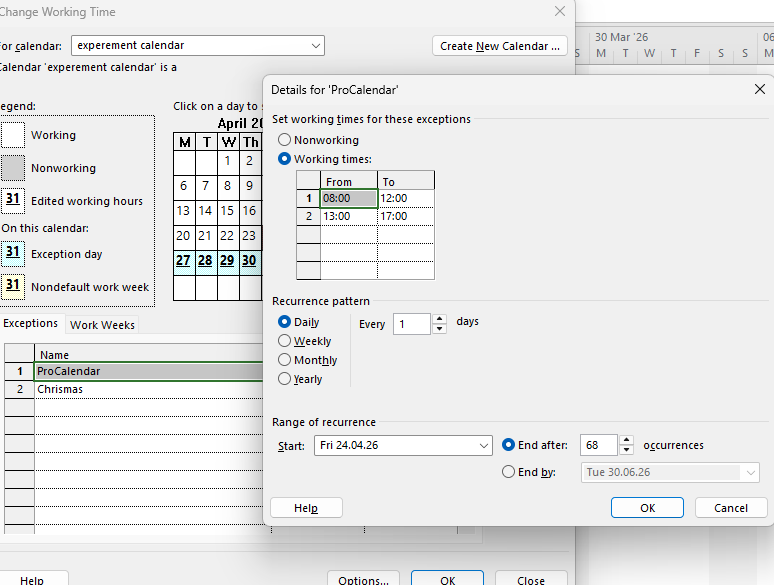
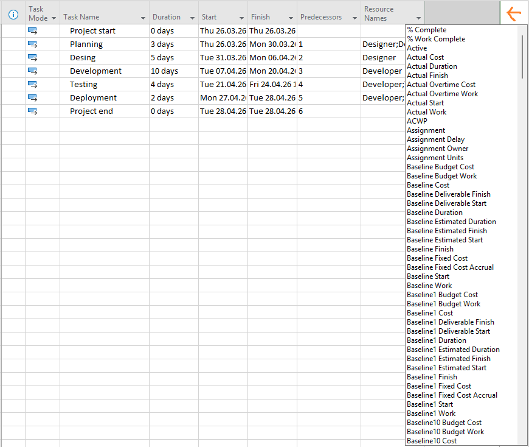
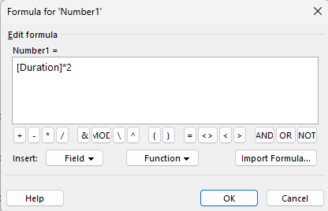
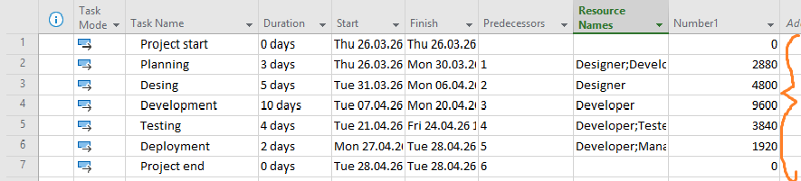
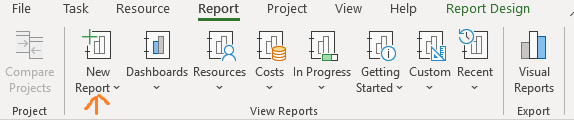
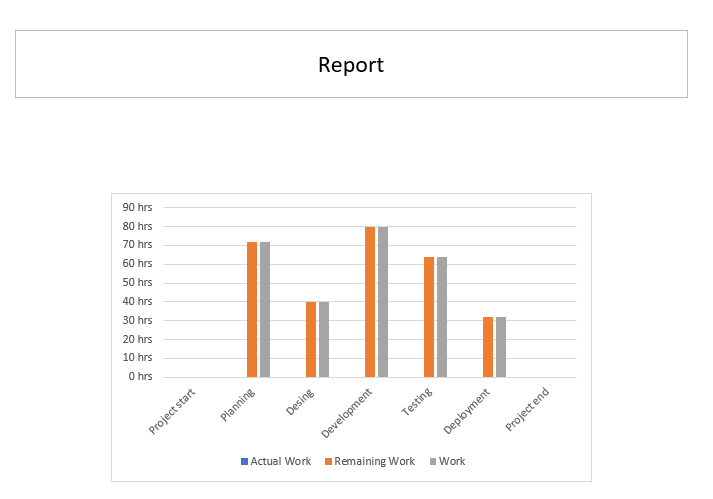

# Microsoft Project veebileht

## Eesmärk

Veebileht selgitab, kuidas kasutada Microsoft Project programmi kalendri ja ajakava haldamiseks.

---

## Lehtede kirjeldus

### index.html – Kalendri loomine


Sellel lehel selgitan, kuidas luua uus kalender Microsoft Projectis. Lisaks samm-sammulisele juhendile on lehel praktilised näited ja visuaalid, mis aitavad mõista kalendri loomise protsessi.

**Põhifunktsioonid:**
- Uue kalendri loomine (sammud ja ekraanipildid)
- Tööaja muutmine (tööaja detailide seadistamine)
- Mitte-tööpäevade määramine (pühade lisamine)
- Kalendri kasutamine projektis (rakendamine projektile)

**Näide navigeerimismenüüst ja juhendist (index.html):**
```html
<div id="rightSidebar" class="sidebar static-sidebar nav-card">
    <h3>Navigeerimine</h3>
    <a href="index.html">Kalender</a>
    <a href="valem.html">Arvutusväli</a>
    <a href="diagramm.html">Diagrammid</a>
</div>

<header>
    <h1>Microsoft Projecti kalendri juhend</h1>
    <p>Samm-sammuline juhend kalendri loomiseks ja kasutamiseks</p>
</header>
```

**Näide sammude loendist (index.html):**
```html
<section class="card">
    <h2>Samm 1: Uue kalendri loomine</h2>
    <ol>
        <li>Mine <strong>Project</strong> vahekaardile</li>
        <li>Klõpsa <strong>Muuda tööaega</strong></li>
        <li>Vali <strong>Loo uus kalender</strong></li>
        <li>Anna oma kalendrile nimi (nt Minu kalender)</li>
        <li>Klõpsa OK</li>
    </ol>
    <figure>
        
        <figcaption>Joonis 1: Uue kalendri loomine</figcaption>
    </figure>
</section>
```

---

### valem.html – Arvutusväli


Sellel lehel kirjeldan arvutusväljade kasutamist. Leht võimaldab lisada uusi veerge, sisestada valemeid ning kuvada tulemusi tabelis.

**Põhifunktsioonid:**
- Uue veeru lisamine (dünaamiline tabel)
- Valemi sisestamine (valemi aken ja sisestus)
- Tulemuse kuvamine tabelis (arvutusvälja tulemus)

**Näide arvutusvälja juhendist ja piltidest (valem.html):**
```html
<section class="card">
    <h2>Arvutusvälja lisamine</h2>
    <ol>
        <li>Lisa uus veerg (Add New Column → Number1)</li>
        <li>Paremklõps veeru nimel ja vali <strong>Custom Fields</strong></li>
        <li>Vajuta <strong>Formula</strong> ja sisesta valem</li>
    </ol>
    <figure>
        
        <figcaption>Figure 5: Uue veeru lisamine projekti</figcaption>
    </figure>
    <figure>
        
        <figcaption>Figure 6: Valemi sisestamise aken</figcaption>
    </figure>
    <figure>
        
        <figcaption>Figure 7: Arvutusvälja tulemus projekti tabelis</figcaption>
    </figure>
</section>
```

---

### diagramm.html – Diagrammid


Sellel lehel selgitan diagrammide kasutamist. Diagrammid aitavad visualiseerida projekti andmeid ja ajakava.

**Põhifunktsioonid:**
- Diagrammi loomine (nt. Gantti diagramm)
- Andmete visualiseerimine (graafikud, värvid)
- Projekti ajakava graafiline esitamine (dünaamiline joonis)

**Näide diagrammi juhendist ja piltidest (diagramm.html):**
```html
<section class="card">
    <h2>Diagrammide loomine</h2>
    <ol>
        <li>Mine <strong>Report</strong> vahekaardile</li>
        <li>Vali <strong>New Report</strong></li>
        <li>Lisa <strong>Chart</strong></li>
        <li>Kohanda diagrammi andmeid</li>
    </ol>
    <figure>
        
        <figcaption>Figure 8: Diagrammi loomine Report vaates</figcaption>
    </figure>
    <figure>
        
        <figcaption>Figure 9: Valmis diagramm projekti andmetega</figcaption>
    </figure>
</section>
```

---

## Navigeerimine

Lehel on menüü, mis võimaldab liikuda kõigi kolme lehe vahel. Menüü on igal lehel nähtav ja kasutajasõbralik.

**Näide navigeerimismenüüst (kasutatud kõigis HTML failides):**
```html
<div id="rightSidebar" class="sidebar static-sidebar nav-card">
    <h3>Navigeerimine</h3>
    <a href="index.html">Kalender</a>
    <a href="valem.html">Arvutusväli</a>
    <a href="diagramm.html">Diagrammid</a>
</div>
```

---

## Kokkuvõte

Veebileht annab ülevaate Microsoft Projecti põhifunktsioonidest ning aitab kasutajal mõista projekti ajakava koostamist.

| Leht         | Kirjeldus                        |
|--------------|----------------------------------|
| index.html   | Kalendri loomine ja haldamine    |
| valem.html   | Arvutusväljade kasutamine        |
| diagramm.html| Diagrammide ja graafikute loomine|

> [!TIP]
> Rohkem infot markdowni kohta: [GitHub Docs – Basic writing and formatting syntax](https://docs.github.com/en/get-started/writing-on-github/getting-started-with-writing-and-formatting-on-github/basic-writing-and-formatting-syntax)
