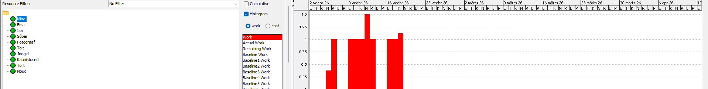

# ProjectLibre veebileht

## Eesmärk

Selle projekti eesmärk oli luua õppeveebileht, kasutades HTML ja CSS keelt.
Fookus oli erinevate HTML elementide kasutamisel.

---

## Kasutatud HTML elemendid

### Pealkirjad (Headings)

Kasutasin erinevaid pealkirju:

* `<h1>` – lehe pealkiri
* `<h2>` – alapealkirjad

Need aitavad struktureerida sisu.

---

### Loetelud (Lists)

Kasutasin järjestatud loetelusid:

```html
<ol>
  <li>Mine View → Gantt</li>
  <li>Vaata ajakava</li>
</ol>
```

See aitab samme selgelt esitada.

---

### Pildid (Images)

Lisatud pildid koos kirjeldustega:

```html

```

Kasutasin ka `<figure>` ja `<figcaption>` elemente.

---

### Lingid (Links)

Navigeerimiseks kasutasin linke:

```html
<a href="index.html">Kalender</a>
```

Need võimaldavad liikuda lehtede vahel.

---

### Navigatsioonimenüü

Lõin menüü lehe ülaossa:

```html
<nav>
  <a href="index.html">Kalender</a>
  <a href="diagramm.html">Diagrammid</a>
</nav>
```

---

### Sisukord (Navigation)

Menüü toimib sisukorrana, mis aitab kasutajal kiiresti liikuda erinevate lehtede vahel.

---

### Tabel (Table)

Tabeli abil saab kuvada andmeid:

```html
<table>
  <tr>
    <th>Ülesanne</th>
    <th>Kestus</th>
  </tr>
  <tr>
    <td>Planeerimine</td>
    <td>3 päeva</td>
  </tr>
</table>
```

---

## CSS kasutamine

Kasutasin eraldi CSS faili:

* kujundasin kaardid (`.card`)
* lisasin hover efektid
* kujundasin navigeerimismenüü

---
